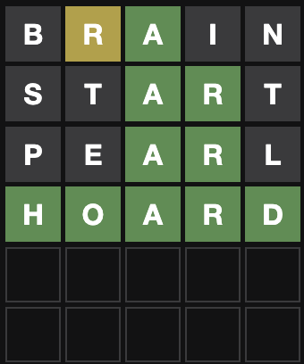

# qordle


[](https://codecov.io/gh/bzimmer/qordle)

Simple wordle solution suggester

## Install

```sh
$ brew tap bzimmer/tap
$ brew install qordle
```

## Usage

`qordle` uses the hits, misses, and a pattern (if known) to suggest words matching the solution.

## Input

* Input correctly placed letters as an uppercase
* Input incorrectly placed letters as a lowercase letter preceeded by any symbol (`~`, `@`)
* Input misses as lowercase letters

## Example



```sh
$ qordle suggest b~rAin stARt peARl
["chard","hoard","dwarf","wharf","award","guard","charm","ovary","quark"]
```

```sh
$ qordle suggest -s position b~rAin stARt peARl
["chard","award","guard","charm","hoard","wharf","dwarf","quark","ovary"]
```

```sh
$ qordle play --start brain table
2022-04-12T11:03:13-07:00 INF play dict=118 next=mabes scores=["~br~ain"] secret=table words=["brain"]
2022-04-12T11:03:13-07:00 INF play dict=5 next=cable scores=["~br~ain","mAB~es"] secret=table words=["brain","mabes"]
2022-04-12T11:03:13-07:00 INF play dict=4 next=fable scores=["~br~ain","mAB~es","cABLE"] secret=table words=["brain","mabes","cable"]
2022-04-12T11:03:13-07:00 INF play dict=3 next=gable scores=["~br~ain","mAB~es","cABLE","fABLE"] secret=table words=["brain","mabes","cable","fable"]
2022-04-12T11:03:13-07:00 INF play dict=2 next=hable scores=["~br~ain","mAB~es","cABLE","fABLE","gABLE"] secret=table words=["brain","mabes","cable","fable","gable"]
2022-04-12T11:03:13-07:00 INF play dict=1 next=table scores=["~br~ain","mAB~es","cABLE","fABLE","gABLE","hABLE"] secret=table words=["brain","mabes","cable","fable","gable","hable"]
["~br~ain","mAB~es","cABLE","fABLE","gABLE","hABLE","TABLE"]
```
